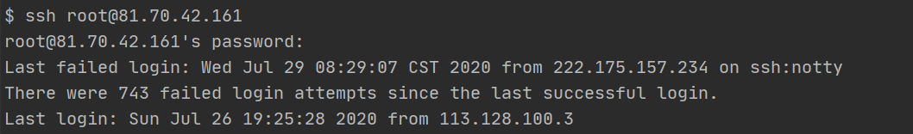

命令行连接，使用Git Bash



```shell
ssh root@81.70.42.161
```


# 2. 软件安装

## 2.1 yum

>yum（Yellow dog Updater, Modified）是一个在 Fedora、RedHat、CentOS 以及 SUSE 中的 Shell 前端软件包管理器。基于 RPM 包管理，能够从指定的服务器自动下载 RPM 包并且安装，可以自动处理依赖性关系，并且一次安装所有依赖的软件包，无须繁琐地一次次下载、安装。

rpm 放置到缓存目录下：**/var/cache/yum/**

**rpm 只能安装已经下载到本地机器上的 rpm 包。而 yum 能在线下载并安装 rpm 包，能更新系统,且还能自动处理包与包之间的依赖问题，这个是 rpm 工具所不具备的。**


**yum - Yellowdog Updater Modified**

```shell
yum [options] [command] [package ...]

 command is one of:
        * install package1 [package2] [...]
        * update [package1] [package2] [...]
        * update-to [package1] [package2] [...]
        * update-minimal [package1] [package2] [...]
        * check-update
        * upgrade [package1] [package2] [...]
        * upgrade-to [package1] [package2] [...]
        * distribution-synchronization [package1] [package2] [...]
        * remove | erase package1 [package2] [...]
        * autoremove [package1] [...]
        * list [...]
        * info [...]
        * provides | whatprovides feature1 [feature2] [...]
        * clean [ packages | metadata | expire-cache | rpmdb | plugins | all ]
        * makecache [fast]
        * groups [...]
        * search string1 [string2] [...]
        * shell [filename]
        * resolvedep dep1 [dep2] [...]
           (maintained for legacy reasons only - use repoquery or yum provides)
        * localinstall rpmfile1 [rpmfile2] [...]
           (maintained for legacy reasons only - use install)
        * localupdate rpmfile1 [rpmfile2] [...]
           (maintained for legacy reasons only - use update)
        * reinstall package1 [package2] [...]
        * downgrade package1 [package2] [...]
        * deplist package1 [package2] [...]
        * repolist [all|enabled|disabled]
        * repoinfo [all|enabled|disabled]
        * repository-packages <enabled-repoid> <install|remove|remove-or-reinstall|remove-or-distribution-synchronization> [package2] [...]
        * version [ all | installed | available | group-* | nogroups* | grouplist | groupinfo ]
        * history [info|list|packages-list|packages-info|summary|addon-info|redo|undo|rollback|new|sync|stats]
        * load-transaction [txfile]
        * updateinfo [summary | list | info | remove-pkgs-ts | exclude-updates | exclude-all | check-running-kernel]
        * fssnapshot [summary | list | have-space | create | delete]
        * fs [filters | refilter | refilter-cleanup | du]
        * check
        * help [command]


```


java安装

```shell
yum install java-1.8.0-openjdk.x86_64

[root@VM-0-3-centos ~]# java -version
openjdk version "1.8.0_252"
OpenJDK Runtime Environment (build 1.8.0_252-b09)
OpenJDK 64-Bit Server VM (build 25.252-b09, mixed mode)

```

# 命令

## 文件查看

### less

```shell
# 打开文件
less filename

安esc
```

