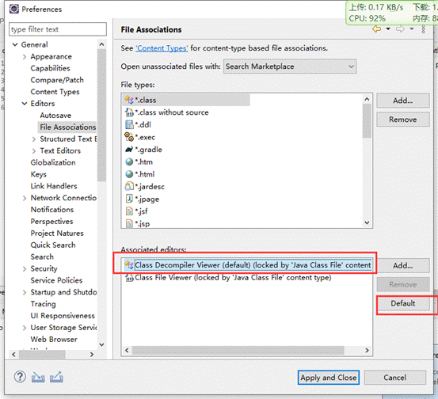
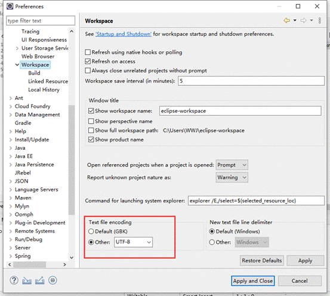
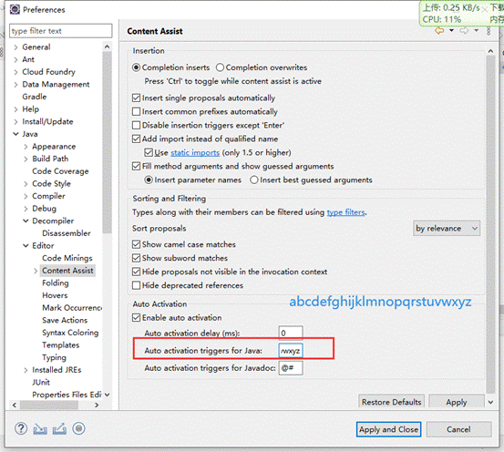

# 快捷键

* CTRL + T 查看接口实现类

- alt+/		代码提示
- ctrl+shift+r 文件查找
- ctrl+alt+上下方向键，快速复制上一行或者下一行
- Ctrl+Alt+↑ 复制当前行到上一行
- ctrl+d删除当前行
- CTRL + O	查看类的函数
- CTRL + 1    万能快捷键

**光标定位**

- Home	行首
- End		行尾
- 上下滚屏：Ctrl+Up/Down
- 在当前行上插入一行：Ctrl+Shift+Enter
- 在当前行下插入一行： Shift+Enter
- 上下移动选中的行：Alt+Up/Down


 

## 插件

 

### 插件一


查看class文件

修改class关联



 

 

### 插件二


热部署

 


 

 

# 配置

## 文件注释设置

```shell
/**
 * @author ${user}
 * @Description: ${todo}
 * @date ${date}
 * @time ${time}
 */
```


## 字符编码utf-8



## Java代码提示



abcdefjhijklmnopqrstuvwxyz