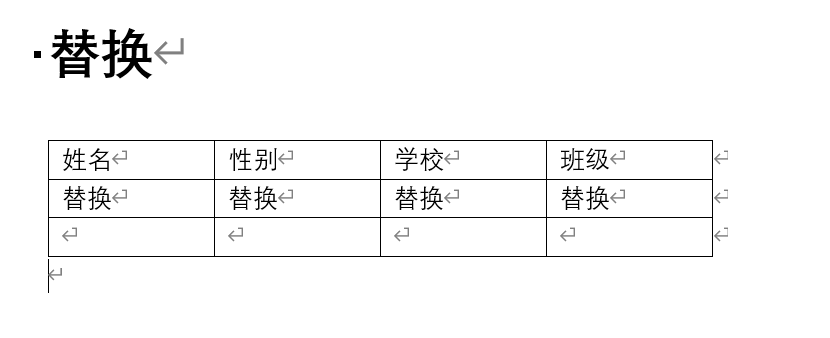
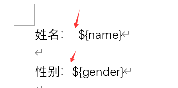
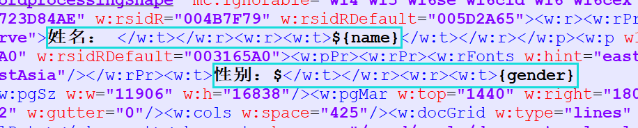
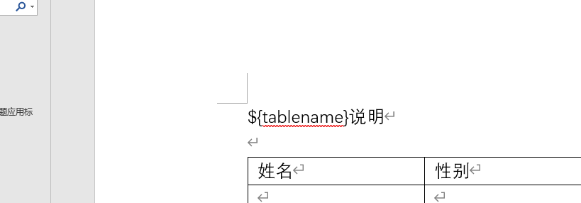

## Freemarker


>Freemarker是模板引擎。FreeMarker就是一种用Java编写的模板引擎， 即一种基于模板和要改变的数据， 并用来生成输出文本（HTML网页、电子邮件、配置文件、源代码等）的通用工具。 它不是面向最终用户的，而是一个Java类库，是一款程序员可以嵌入他们所开发产品的组件。


## 1. word xml

word的xml格式，另一种word的存储方式

### 1.2 table


doc格式和xml格式之间的映射


## 2. ftl

>ftl（FreeMarker Template Language）是Freemarker模板的文件后缀名。


**pom.xml**

```xml
<parent>
    <artifactId>spring-boot-starter-parent</artifactId>
    <groupId>org.springframework.boot</groupId>
    <version>2.2.6.RELEASE</version>
</parent>

<dependencies>
    <dependency>
        <groupId>org.springframework.boot</groupId>
        <artifactId>spring-boot-starter-freemarker</artifactId>
    </dependency>
</dependencies>
```


```java
package freemarker.demo;

import java.io.File;
import java.io.IOException;

public class Main {

    public static void main(String[] args) {

        /**
         * 新建一个文件，创建成功返回true
         */
        String pathname = "pathname_test.txt";
        //默认路径在当前项目根目录下，使用的是相对路径
        File file = new File(pathname);
        boolean newFile = false;
        try {
            newFile = file.createNewFile();
        } catch (IOException e) {
            System.out.println("创建失败");
            e.printStackTrace();
        }
        System.out.println(newFile);
    }
}

```


### 生成word


#### ${}占位符被分离

> 解决方法：把占位符在notepad中写好，复制到word中，否则直接在word中写会存在被分离的可能

**word文件内容**

> 使用一个特殊的标志，用来表示需要用变量代替的内容，此处使用了“替换”两字，可以自行定义




**注意word中的写法**



姓名后面的冒号之后必须再加个空格，可以是中文空格也可以是英文空格，否则$和{}会分开








**另存为，xml文件**；**或者直接保存为xml文件**

> 必须使用另存为，不能自己修改后缀名，**也可以保存文档时直接保存为 “Word XML 文档”** ，xml文档和doc文档都是可以直接编辑的


**直接修改xml后缀为ftl**


**当${}不能自动生成时，需要手动打开ftl文件，找到标志**


**替换成变量值**


其它行字段都修改为代码中map里对应的key值

对应赋值代码


```shell
<#if outList??>
对象不为空
</#if>
```


null判断

```shell
${outList.desc!"当前内容为空"}

判断outList.desc的值是否为空，如果为空，就使用!后的内容代替
```

获得list下标

```shell
<#list serviceOperationList as opList>
${opList_index}

# 获得opList的下标，在opList后面加一个_index，获得的下标是从0开始的

${opList_index+1}
# 通过运算修改下标值
```

for循环

```shell
<#list serviceOperationList as opList>
	
	<#--中间需要循环的部分-->

</#list>

# serviceOperationList是map中存储的List对象的key值
```

