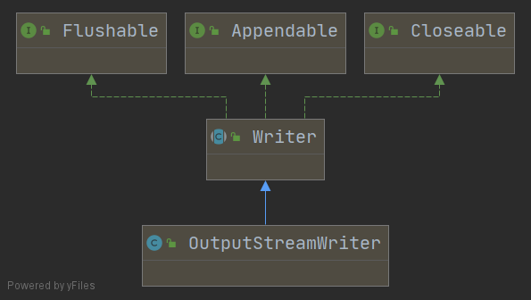
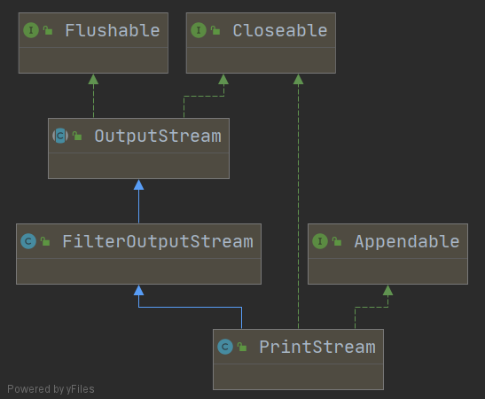
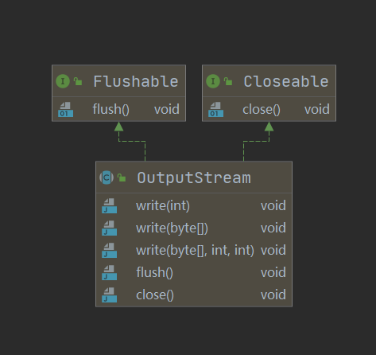
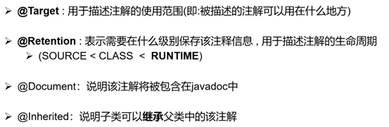
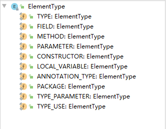
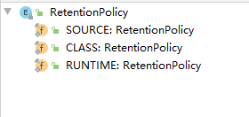
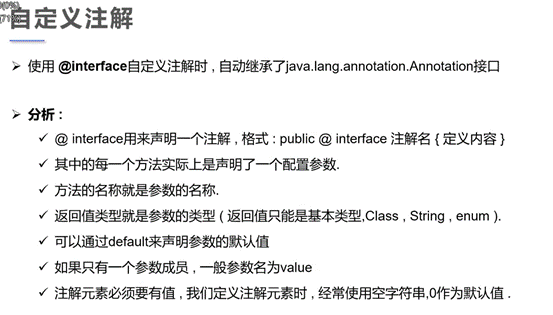

# 接口

>在设计接口方法时不抛出异常，就会造成实现的类即使需要抛异常也无法抛弃的情况，因此，在实际开发中，一般都要在接口的方法抛出异常。


# 文件

## OutputStreamWriter

>从字符流到字节流的桥梁



## PrintStrean





## OutputStream




# 访问权限


## protected

可以被子类bai，同package下类使用，不对外公开的访问修饰du符。


JNDI（Java Naming and Directory Interface ），类似于在一个中心注册一个东西，以后要用的时候，只需要根据名字去注册中心查找，注册中心返回你要的东西。

# 代理


## cglib代理


```xml
<dependency>
    <groupId>cglib</groupId>
    <artifactId>cglib-nodep</artifactId>
    <version>3.2.12</version>
</dependency>
```


# Java容器

## List


```java
public static void main(String[] args) {
        ArrayList<String> arrayList = new ArrayList<>();
        arrayList.add("a");
        arrayList.add("b");
        arrayList.add("c");

        //输出方式一，lambda表达式
        arrayList.forEach(x-> System.out.println(x));

        //输出方式二，lambda简写
        arrayList.forEach(System.out::println);
    }
```

### ArrayList

```java
ArrayList<String> stringArrayList = new ArrayList<>();
String x = "aaa";
boolean r1 = stringArrayList.add(x);
boolean r2 = stringArrayList.add(x);
stringArrayList.forEach(param-> System.out.println(param));
```

```shell
aaa
aaa
```


```java
ArrayList<String> stringArrayList = new ArrayList<>();
boolean aaa = stringArrayList.add("aaa");
boolean aaa1 = stringArrayList.add("aaa");
stringArrayList.forEach(x-> System.out.println(x));
```

```shell
aaa
aaa
```


foreach修改不了代码

```java
List<String> strings = Arrays.asList("str1", "str1", "str1");
for (String string : strings) {
    string = "oooo";
}
strings.forEach(x-> System.out.println(x));
```

```shell
str1
str1
str1
```


```java
List<String> strings = Arrays.asList("str1", "str1", "str1");
for (String string : strings) {
    string = "oooo";
}
strings.forEach(x-> System.out.println(x));

Iterator<String> iterator = strings.iterator();
while (iterator.hasNext()){
    String next = iterator.next();
    System.out.println(next);
}
```


子代码块使用相同的变量名

#### List foreach遍历

##### 值修改问题


**foreach修改List中对象的参数值**

```java
class Demo{

    String param;

    public Demo(String param) {
        this.param = param;
    }

    public void setParam(String param) {
        this.param = param;
    }

    public String getParam() {
        return param;
    }

    @Override
    public String toString() {
        return "Demo{" +
                "param='" + param + '\'' +
                '}';
    }
}
```


**不修改引用**

```java
ArrayList<Demo> demoArrayList = new ArrayList<>();
demoArrayList.add(new Demo("aaa"));
for (Demo demo : demoArrayList) {
    //修改Demo对象的param值
    demo.setParam("bbb");
}
demoArrayList.forEach(x -> System.out.println(x));
```

输出

对象中参数的值给修改了

```shell
Demo{param='bbb'}
```

**修改引用**

```java
ArrayList<Demo> demoArrayList = new ArrayList<>();
demoArrayList.add(new Demo("aaa"));
for (Demo demo : demoArrayList) {
    //修改对象引用
    Demo bbb = new Demo("bbb");
    demo = bbb;
}
demoArrayList.forEach(x -> System.out.println(x));
```

输出：

对象的引用没有修改

```shell
Demo{param='aaa'}
```


### StringBuffer


```java
# 设置长度为0，stringBuffer不会为null
StringBuffer stringBuffer = new StringBuffer();
stringBuffer.setLength(0);
```


append的返回值，就是当前引用，因此a,b,c,stringBuffer是同一个对象

```java
StringBuffer stringBuffer = new StringBuffer();
System.out.println("默认capacity:"+ stringBuffer.capacity());
StringBuffer a = stringBuffer.append("this");
System.out.println(a);
StringBuffer b = stringBuffer.append(" is");
System.out.println(b);
StringBuffer c = stringBuffer.append(" StringBuffer.");
System.out.println(c);

if (stringBuffer == c){
    System.out.println("yes");
}else {
    System.out.println("false");
}
```

输出

```shell
默认capacity:16
this
this is
this is StringBuffer.
yes
```


?为什么不是0

```java
StringBuffer stringBuffer = new StringBuffer();
System.out.println("默认capacity:" + stringBuffer.capacity());
StringBuffer a = stringBuffer.append("this");
StringBuffer b = stringBuffer.append(" is");
StringBuffer c = stringBuffer.append(" StringBuffer.");
System.out.println(stringBuffer.capacity());
stringBuffer.setLength(0);
System.out.println(stringBuffer.capacity());
```

输出

```shell
默认capacity:16
34
34
```


# Java泛型

> 泛型是 Java 1.5 版本才引进的概念，在这之前是没有泛型的概念的，但显然，泛型代码能够很好地和之前版本的代码很好地兼容。
>
> 这是因为，**泛型信息只存在于代码编译阶段，在进入 JVM 之前，与泛型相关的信息会被擦除掉，专业术语叫做类型擦除**。

* 提供了一种类型检测的机制，只有相匹配的数据才能正常的赋值，否则编译器就不通过。
* 泛型提高了程序代码的可读性，不必要等到运行的时候才去强制转换，在定义或者实例化阶段


```java
//java6及以前，构造方法中不可以省略泛型类型
ArrayList<String> stringList6 = new ArrayList<Stirng>();

//java7及以后，构造方法中可以省略泛型类型
ArrayList<String> stringList6 = new ArrayList<>();
```


```java
public static void main(String[] args) {
        ArrayList<String> stringArrayList = new ArrayList<>();
        ArrayList<Integer> integerArrayList = new ArrayList<>();


        Class<? extends ArrayList> aClass = stringArrayList.getClass();
        Class<? extends ArrayList> aClass1 = integerArrayList.getClass();
        if (aClass == aClass1)
            System.out.println(true);
        else
            System.out.println(false);

        //输出true
        //List<String>和 List<Integer>在 jvm 中的 Class 都是 List.class。
    }
```


```java
class Demo<T>{
    T object;

    public Demo(T object) {
        this.object = object;
    }

    public Demo() {

    }

    public void add(T object){

    }
}
public class Java8 {
    public static void main(String[] args) {
        Demo<String> demo = new Demo<>();
        Class<? extends Demo> demoClass = demo.getClass();

        
        String param = "param";
        demo.add(param);
        
        //下面是错误的，这就是泛型的缺点
        /*
        Integer paramInt = 5;
        demo.add(paramInt);
        */
        

        Method[] declaredMethods = demoClass.getDeclaredMethods();
        for (Method declaredMethod : declaredMethods) {
            System.out.println(declaredMethod);
        }
        //输出：public void Demo.add(java.lang.Object)
        //可以看出add函数类型已经被擦除为Object了
    }

}
```


**可以利用类型擦除的原理，用反射的手段就绕过了正常开发中编译器不允许的操作限制**

列子一

```java
class Demo<T>{
    T object;

    public Demo(T object) {
        this.object = object;
    }

    public Demo() {

    }

    public void add(T object){
        System.out.println(object);
    }
}
public class Java8 {
    public static void main(String[] args) {

        Demo<String> demo = new Demo<>();
        Class<? extends Demo> demoClass = demo.getClass();

        String param = "param";
        demo.add(param);

        //下面是错误的，这就是泛型的缺点
        /*
        Integer paramInt = 5;
        demo.add(paramInt);
        */

        /*
        通过反射，使的上面的Integer可以正常输出，add函数类型擦除之后，参数类型变为Object了，不再是String
         */
        try {
            //修改参数类型为Object，就可以输出任意类型的
            Method add = demoClass.getDeclaredMethod("add", Object.class);
            Object invoke = add.invoke(demo, 5);
        }catch (Exception e){
            System.out.println("输出异常");
            e.printStackTrace();
        }

    }

}
```

例子二

>因为类型擦除，它会抹掉很多继承相关的特性，这是它带来的局限性。使用反射绕过泛型

```java
public static void main(String[] args) {

        ArrayList<Integer> arrayList = new ArrayList<>();
        arrayList.add(5);
        // arrayList.add("588"); 编译不通过

        Class<? extends ArrayList> arrayListClass = arrayList.getClass();

        try {
            Method add = arrayListClass.getDeclaredMethod("add", Object.class);
            Object invoke = add.invoke(arrayList, "你好");
            System.out.println(invoke);

        }catch (Exception e){
            System.out.println("输出异常");
        }
        //arrayList.forEach(x-> System.out.println(x));//输出会出错，这个函数还是有类型的
        for(Object x: arrayList){
            System.out.println(x);
        }
    }

/*输出
true
5
你好
*/
```


## 通配符

通配符有 3 种形式。

1. `<?>`被称作无限定的通配符。
2. `<? extends T>`被称作有上限的通配符。
3. `<? super T>`被称作有下限的通配符。

# Java8新特性

## Lambda 


Lambda 允许把函数作为一个方法的参数

```shell
# 语法
(parameters) -> expression
或
(parameters) ->{ statements; }
```

lambda表达式的重要特征:

- **可选类型声明：**不需要声明参数类型，编译器可以统一识别参数值。
- **可选的参数圆括号：**一个参数无需定义圆括号，但多个参数需要定义圆括号。
- **可选的大括号：**如果主体包含了一个语句，就不需要使用大括号。
- **可选的返回关键字：**如果主体只有一个表达式返回值则编译器会自动返回值，大括号需要指定明表达式返回了一个数值。

**使用lambda表达式实现接口**

```java
interface IDemo{

    int sum(int a, int b);

    default void show(){
        System.out.println("你好");
    }
}

public class Java8 {
    public static void main(String[] args) {

        //使用lambda表达式
        IDemo iDemo = (a, b) -> a + b;
        System.out.println(iDemo.sum(3, 5));
        
        //使用匿名类实现
        IDemo iDemo = new IDemo() {
            @Override
            public int sum(int a, int b) {
                return a + b;
            }
        };
        //使用方法引用
        IDemo iDemo = Java8::sum;
        System.out.println(iDemo.sum(3, 5));
    }
    
    //被引用的方法
    static int sum(int a, int b){
        return a + b;
    }
}
```


### 双冒号（方法引用）


双冒号（::）运算符在Java 8中被用作**方法引用（method reference）**，它提供了一种不执行方法的方法

>双冒号运算操作符是类方法的句柄，lambda 表达式的一种简写

**出现原因**

>使用lambda表达式会创建匿名方法， 但有时候需要使用一个lambda表达式调用一个已经存在的方法（不做其它）， 所以这才有了方法引用！

例子

```java
public class Java8 {
    public static void main(String[] args) {

        List<String> stringList = Arrays.asList("a", "b", "c");
        
        //forEach需要传入一个函数
        //Java8::show 就是对已有静态方法的引用
        stringList.forEach(Java8::show);
        
        //lambda表达式匿名方法
        stringList.forEach(x-> System.out.println(x));
        
        //使用匿名类
        stringList.forEach(new Consumer<String>(){

            @Override
            public void accept(String s) {
                System.out.println(s);
            }

            @Override
            public Consumer<String> andThen(Consumer<? super String> after) {
                return null;
            }
        });

    }
    static void show(String x){
        System.out.println(x);
    }
}
```


方法引用的一些语法：

1. 静态方法引用（static method）语法：classname::methodname 例如：Person::getAge
2. 对象的实例方法引用语法：instancename::methodname 例如：System.out::println
3. 对象的超类方法引用语法： super::methodname
4. 类构造器引用语法： classname::new 例如：ArrayList::new
5. 数组构造器引用语法： typename[]::new 例如： String[]:new


### 闭包

> 函数`lazy_sum`中又定义了函数`sum`，并且，内部函数`sum`可以引用外部函数`lazy_sum`的参数和局部变量，当`lazy_sum`返回函数`sum`时，相关参数和变量都保存在返回的函数中，这种称为“闭包（Closure）”的程序结构拥有极大的威力。

* 闭包可以返回一个函数然后延迟执行
* 在没有`class`机制，只有函数的语言里，借助闭包，同样可以封装一个私有变量。

## Java函数式编程


# 注解

### jdk内置注解

 

重写

```java
package java.lang; import java.lang.annotation.*; 
@Target(ElementType.METHOD)
@Retention(RetentionPolicy.SOURCE) 
public @interface Override {   }
```

 

不推荐使用，已经过时

```java
package java.lang;
import java.lang.annotation.*; 
import static java.lang.annotation.ElementType.*;
@Documented @Retention(RetentionPolicy.RUNTIME)
@Target(value={CONSTRUCTOR, FIELD, LOCAL_VARIABLE, METHOD, PACKAGE, PARAMETER, TYPE}) 
public @interface Deprecated { }
```


 

镇压警告

可以设置value来选定要注解的警告

 

```java
package java.lang; 
import java.lang.annotation.*; 
import static java.lang.annotation.ElementType.*;  
@Target({TYPE, FIELD, METHOD, PARAMETER, CONSTRUCTOR, LOCAL_VARIABLE}) @Retention(RetentionPolicy.SOURCE) 
public @interface SuppressWarnings {    
    //value不是一个函数，是一个参数   String[] value(); 
}
```


## 元注解

* 元注解的作用就是负责注解其他注解, Java定义了4个标准的meta-annotation类型，他们被用来提供对其他annotation类型作说明.

* 这些类型和它们所支持的类在java.lang annotation包中可以找到.( @Target , @Retention，@Documented , @Inherited )



 

```java
@Documented 
@Retention(RetentionPolicy.RUNTIME)
//表示注解在运行时有效，一般框架都是用的这一级别 
@Target(ElementType.ANNOTATION_TYPE) 
public @interface Target {   
    /**   
    * Returns an array of the kinds of elements an annotation type  
    * can be applied to.   
    * @return an array of the kinds of elements an annotation type  
    * can be applied to  
    */   
    ElementType[] value(); 
}
```

Target value可选值



 

```java
@Documented 
@Retention(RetentionPolicy.RUNTIME) 
@Target(ElementType.ANNOTATION_TYPE) 
public @interface Retention {   
    RetentionPolicy value(); 
}
```

Retention value可选值



SOURCE只在源文件中有效

CLASS只在class文件中有效

RUNTIME 在运行时有效

有效范围RUNTIME>CLASS>SOURCE，优先级越高，有效范围越大，RUNTIME有效范围最大

 

# 自定义注解



 

 

例子

```java
package demo.wwj; 
import java.lang.annotation.ElementType;
import java.lang.annotation.Retention; 
import java.lang.annotation.RetentionPolicy; 
import java.lang.annotation.Target;
@ClassAnnotation("这是一个class注解") 
public class Test{    
    //只有一个赋值时，value名称的变量可以省略value   
    @FieldAnnotation1("小明")   
    String param1;   
    //当不止一个变量时，value名也得写入   
    @FieldAnnotation1(value = "小明", name = "小红")   
    String param3;   
    @FieldAnnotation2(name = "小明")   
    String param2;   
    //如果没有默认值，就必须给注解赋值   
    @DemoAnnotation(param2 = "haha")   
    String getName() {      
        return "haha"; 
    } 
} 


@Target({ElementType.TYPE, ElementType.METHOD})
@Retention(RetentionPolicy.RUNTIME)
@interface DemoAnnotation{  
    String param1() default "nihao";  
    String param2();
} 


/** 
* 用在类、接口上 
*/ 
@Target(ElementType.TYPE)
@Retention(RetentionPolicy.RUNTIME) 
@interface ClassAnnotation{   
    //只有一个值时，可以使用value，value可以默认不写   
    String value(); 
} 


/**
    * 用在成员变量上 
    */ 
@Target(ElementType.FIELD) 
@Retention(RetentionPolicy.RUNTIME) 
@interface FieldAnnotation1{   
    //只有一个值时，可以使用value   
    String value();   
    String name() default "xioahong";
} 

@Target(ElementType.FIELD)
@Retention(RetentionPolicy.RUNTIME) 
@interface FieldAnnotation2{   
    //只有一个值时，可以使用value   
    String name();
}
```

 