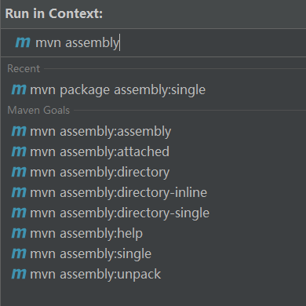

## 插件配置

常用插件


### maven-assembly-plugin

```shell
<build>
        <plugins>

            <!--支持定制化打包方式-->
            <plugin>
                <groupId>org.apache.maven.plugins</groupId>
                <artifactId>maven-assembly-plugin</artifactId>
                <version>2.2-beta-5</version>
                <configuration>
                    <descriptorRefs>
                        <descriptorRef>
                            jar-with-dependencies
                        </descriptorRef>
                    </descriptorRefs>
                </configuration>
                <!--<executions>
                    <execution>
                        <id>make-assembly</id>
                        <goals>
                            <goal>single</goal>
                        </goals>
                    </execution>
                </executions>-->
            </plugin>
        </plugins>
    </build>
```


插件命令



### 常用依赖配置


```xml
<parent>
<artifactId>spring-boot-starter-parent</artifactId>
<groupId>org.springframework.boot</groupId>
<version>2.2.6.RELEASE</version>
</parent>

<dependencies>
    <dependency>
    <groupId>org.springframework.boot</groupId>
    <artifactId>spring-boot-starter</artifactId>
    </dependency>
    <dependency>
    <groupId>org.springframework.boot</groupId>
    <artifactId>spring-boot-starter-jdbc</artifactId>
    </dependency>
</dependencies>
```


```xml
<parent>
    <groupId>org.springframework.boot</groupId>
    <artifactId>spring-boot-starter-parent</artifactId>
    <version>2.3.0.RELEASE</version>
</parent>

<dependencies>
    <dependency>
        <groupId>org.springframework.boot</groupId>
        <artifactId>spring-boot-starter-web</artifactId>
    </dependency>
    <dependency>
        <groupId>org.springframework.boot</groupId>
        <artifactId>spring-boot-starter-jdbc</artifactId>
    </dependency>
    <dependency>
        <groupId>mysql</groupId>
        <artifactId>mysql-connector-java</artifactId>
        <!-- <version>8.0.18</version> -->
    </dependency>
    <dependency>
        <groupId>com.mchange</groupId>
        <artifactId>c3p0</artifactId>
        <version>0.9.5.5</version>
    </dependency>
</dependencies>
```


## 命令行


```shell
# 导出依赖包
mvn dependency:copy-dependencies -DoutputDirectory=C:\Users\WWJ\Desktop\lib
```


## settings配置


**settings.xml**

```xml
<?xml version="1.0" encoding="UTF-8"?>

<!-- 配置文件默认位置${user.home}/.m2/settings.xml -->
<settings>


    <!-- 配置本地存储库 -->
    <!-- 默认值${user.home}/.m2/repository/ -->
    <localRepository>${user.home}/.m2/repository/</localRepository>
    <!-- 配置给定存储库的镜像 -->

    <servers>
        <!--公司服务器-->
        <server>
            <id>nexus</id>
            <username>admin</username>
            <password>admin123</password>
        </server>
    </servers>
    
    <mirrors>

        <!-- 阿里云仓库 -->
        <mirror>
            <id>alimaven</id>
            <name>aliyun maven</name>
            <url>http://maven.aliyun.com/nexus/content/groups/public/</url>
            <mirrorOf>central</mirrorOf>
        </mirror>

        <!--公司仓库-->
        <mirror>
            <id>nexus</id>
            <mirrorOf>central</mirrorOf>
            <name>nexus</name>
            <url>http://10.1.60.200:8082/repository/dareway-public/</url>
        </mirror>
    </mirrors>

    
</settings>
```


## maven命令使用

```shell
# 导出项目所有的依赖项到默认目录中，即target目录
mvn dependency:copy-dependencies
```


## maven配置文件使用


设置jdk版本

```shell
<build>
        <plugins>
            <plugin>
                <groupId>org.apache.maven.plugins</groupId>
                <artifactId>maven-compiler-plugin</artifactId>
                <version>3.8.1</version>
                <configuration>
                    <source>1.8</source>
                    <target>1.8</target>
                </configuration>
            </plugin>
        </plugins>
    </build>
```

