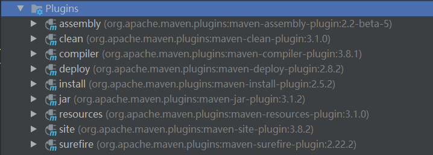

## 插件配置

常用插件




```shell
<build>
    <plugins>

        <!--支持定制化打包方式-->
        <plugin>
            <groupId>org.apache.maven.plugins</groupId>
            <artifactId>maven-assembly-plugin</artifactId>
            <version>2.2-beta-5</version>
        </plugin>
    </plugins>
</build>
```

